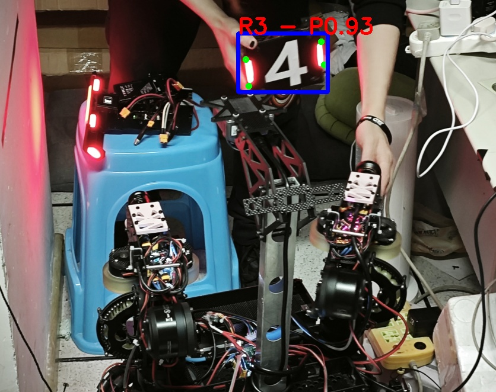

## TODO
- 前处理&推理&后处理和socket发送 异步运行

## 模型存在的问题
- 训练时没开旋转增强，装甲板跟相机转角过大就不能识别了
- 分类器不太准，能分清红蓝，但不太能分清编号
    - 认不出哨兵，会把XS(哨兵) 认成 X2/X3/X4/X5
    - 少数情况下会把X3/X4(步兵) 认成 XO(基地)
        - 但至少要能分出英雄跟其他，能按照大/小装甲板来PNP，也能分清红蓝
        - 鉴于联盟赛没基地，出现XO就知道他一定是步兵
        - 勉强能用

## 环境要求
- OpenCL 3.0
- Opencv >= 4.8 并且开启DNN和OpenCL模块
- Openvino 2024.6.0


## 参数解释
配置文件存放在`/config`下，有`config.yaml`和`camera_paramets.yaml`两个。`camera_paramets.yaml`在标定相机的时候自动生成，`config.yaml`中的配置项如下：
- 推理配置
    - `model_path_xml`和`model_path_xml`：模型目录
    - `conf_threshold`：至信度阈值
    - `rect_cut`: 是否把相机画面裁切成正方形
        - 不裁切也可以正常跑，但是因为yolo的输入是正方形的画面，进行letter_box resize之后会损失一些像素量
        - **切换之后需要重新标定相机**
- 相机标定配置
    - `boardSize_h`,`boardSize_w`：标定板长宽
    - `squareSize`: 标定板每个格子的宽度
    - `img_count`：采集多张图片进行标定
    - `sample_period`：间隔多少帧采集一张图片
    - `calib_yaml_path`：保存相机标定参数的yaml文件的路径
- 相机设置
    - `cam_gain`：相机增益，类似于ISO，0~16.8，建议直接设置为最大
    - `cam_exptime`：曝光时间
    - `framerate`：帧率限制
- 装甲板参数
    - `armor_small_h`,`armor_small_w`: 小装甲板长宽（灯条）
    - `armor_large_h`, `armor_large_w`: 大装甲板长宽（灯条）
- debug选项
    - `imshow_en`: 是否显示画面
    - `debug_info`：是否显示调试log（未使用）

## 输出格式
pnp解算结果输出格式为`std::vector<yolo_kpt::Object>`，其中`yolo_kpt::Object`包含：
- 图像识别结果
    - `cv::Rect_<float> rect`判定框
    - `int label` 标签
    - `float prob`  至信度
- PNP结果
    - `int pnp_is_calculated`-1无解，0未计算，1计算完成
    - `int kpt_lost_index`角点缺失索引，0-左上，1-左下，2-右下，3-右上，-1无缺失（四个角点都有）
    - `cv::Mat pnp_tvec`平移向量（相机原点）
    - `cv::Mat pnp_rvec`选装向量（相机原点）


## 性能测试
在GKD的老NUC上，前处理&推理&后处理一帧的用时是(单位ms)：
```
--------------------
preprocess time:6.40602
inference time:16.3719
postprocess time:0.343069
total time:23.1592
--------------------
```
GPU(intel核显)占用在62%左右，cpu会把某一个核心占用到60%左右，整体占用10%左右
直接使用的话大概可以稳定跑在40帧

可以优化的点：
- 前处理和推理用`cv::dnn::blobFromImage`或者`cv::Umat`全部跑在gpu流水线上，但这样似乎需要用openCL-kernal手写latterbox-resize(opencv好像没有能跑在GPU上的letterbox resize？)
    - 或者直接把前处理和推理异步运行
- 模型裁切到fp16精度，如果核显对fp16有优化推理速度可以快很多
    - 但是会降低四点精度

## 效果


## 环境配置

``` shell

sudo install neofetch btop
sudo apt install cmake git build-essential
sudo apt install clinfo clpeak 

#GPU驱动----
#需要升级内核到6.x才能在新nuc上安装gpu驱动
#老nuc不需要升级
sudo apt install --install-recommends linux-generic-hwe-22.04

#安装intel核显OpenCL驱动
#参考：https://github.com/intel/compute-runtime
mkdir neo
cd neo
wget https://github.com/intel/intel-graphics-compiler/releases/download/v2.5.6/intel-igc-core-2_2.5.6+18417_amd64.deb
wget https://github.com/intel/intel-graphics-compiler/releases/download/v2.5.6/intel-igc-opencl-2_2.5.6+18417_amd64.deb
wget https://github.com/intel/compute-runtime/releases/download/24.52.32224.5/intel-level-zero-gpu-dbgsym_1.6.32224.5_amd64.ddeb
wget https://github.com/intel/compute-runtime/releases/download/24.52.32224.5/intel-level-zero-gpu_1.6.32224.5_amd64.deb
wget https://github.com/intel/compute-runtime/releases/download/24.52.32224.5/intel-opencl-icd-dbgsym_24.52.32224.5_amd64.ddeb
wget https://github.com/intel/compute-runtime/releases/download/24.52.32224.5/intel-opencl-icd_24.52.32224.5_amd64.deb
wget https://github.com/intel/compute-runtime/releases/download/24.52.32224.5/libigdgmm12_22.5.5_amd64.deb
wget https://github.com/intel/compute-runtime/releases/download/24.52.32224.5/ww52.sum
sha256sum -c ww52.sum
sudo dpkg -i *.deb
sudo apt install ocl-icd-libopencl1
sudo apt install clinfo intel_gpu_top

#可以用clpeak给gpu跑分
git clone https://github.com/krrishnarraj/clpeak
cd clpeak
mkdir build && cd build
cmake ..
make -j
./clpeak

#查看GPU占用
sudo intel_gpu_top

#OpenCV----
#编译安装opencv4.8, 开启OpenCL支持和DNN GTK
#满足这些配置项的opencv不在apt包里，所以要自己编译

#处理依赖地狱
sudo apt install libgtk2.0-dev libgtk-3-dev
sudo apt-get install libeigen3-dev libgflags-dev libgoogle-glog-dev
sudo apt-get install libtesseract-dev
sudo apt-get install ffmpeg libavcodec-dev libavformat-dev libavutil-dev libswscale-dev
#编译安装
git clone -b 4.8.0 https://github.com/opencv/opencv
git clone -b 4.8.0 https://github.com/opencv/opencv_contrib
cd opencv
mkdir build && cd build
cmake -DCMAKE_BUILD_TYPE=Release \
      -DCMAKE_INSTALL_PREFIX=/usr/local \
      -DBUILD_opencv_world=OFF \
      -DBUILD_EXAMPLES=OFF \
      -DBUILD_TESTS=OFF \
      -DBUILD_DOCS=OFF \
      -DBUILD_opencv_dnn=ON \
      -DWITH_OPENCL=ON \
      -DENABLE_OPENCL=ON \
      -DWITH_TBB=ON \
      -DWITH_EIGEN=ON \
      -DWITH_GTK=ON \
      -DWITH_FFMPEG=ON \
      -DOPENCV_EXTRA_MODULES_PATH=/home/fish/opencv_contrib/modules ..
make -j
make install

#OpenVino----
wget https://apt.repos.intel.com/intel-gpg-keys/GPG-PUB-KEY-INTEL-SW-PRODUCTS.PUB
sudo apt-key add GPG-PUB-KEY-INTEL-SW-PRODUCTS.PUB
echo "deb https://apt.repos.intel.com/openvino/2024 ubuntu22 main" | sudo tee /etc/apt/sources.list.d/intel-openvino-2024.list
sudo apt update
sudo apt install openvino-2024.6.0

```